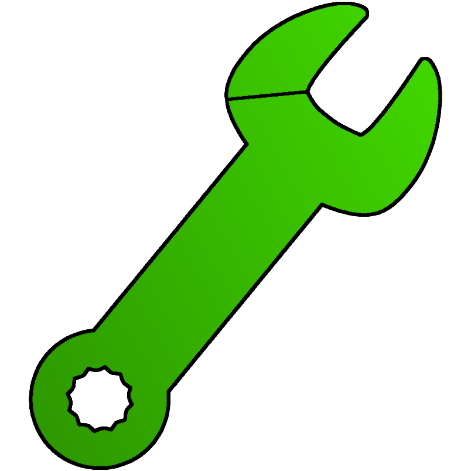
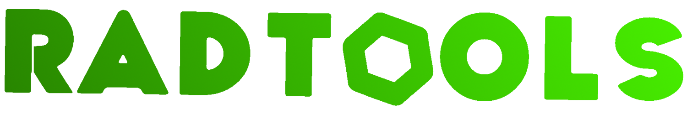



  

---

# RadTools

RadTools is a collection of fixes and tools that I have found myself for early 2021 builds of Rec Room, specifically targetting [Radium.](https://radie.app)
These fixes are not intended to be used as cheats and do not intentionally exhibit any cheating behaviour. They're not guaranteed to work on all versions of Rec Room, nor work all of the time, but they do their best.

They are intended to be used by players who are having troubles with Radium, specifically connecting to rooms.

RadTools does not send any data. RadTools does not read any files. RadTools is solely just a debugging and quality-of-life mod. It is not a cheat, it is not a base for cheats, and it never will be. Cheating is bad.
> cough cough i'd never give you cheats publically anymore COUGH chgfhhfgouvhnxvc.

  
<b>Installation</b>

	
1. **Download** the latest release **[here](https://github.com/iiDk-the-actual/RadTools/releases/latest)**
2. **Drag & Drop** `RadTools.dll` into your plugins folder  
3. **Launch** Rec Room and enjoy!

**From Source Code (for developers!)**

1. Download the source code **[here](https://github.com/iiDk-the-actual/RadTools/releases/latest)**
2. Edit `Directory.Build.props` and update `<GamePath>` to your Rec Room installation path (e.g. `C:\Program Files\Rec Room`)
3. Build the project with `Ctrl + Shift + B` 
✅ The DLL will automatically go into your game's plugins folder

  
<b>Contact Information</b>

	
Need help or want to collaborate? Here are some of my sources of contact:
- Telegram: [@crimsoncauldron](https://t.me/crimsoncauldron)
- Discord: [@crimsoncauldron](https://discord.gg/iidk)
- YouTube: [@iiDk_](https://www.youtube.com/@iiDk_)
- Email: [admin@goldentrophy.software](mailto:admin@goldentrophy.software)

  
<b>Support <3</b>

	
If you wish to support me, here are some of the ways you can!

| Platform   | Link | Address |
|------------|------|---------|
| Bitcoin    |  | [bc1qtmrqtq4ag720tvux64ff3rjp632jy2d447p3nx](bitcoin:bc1qtmrqtq4ag720tvux64ff3rjp632jy2d447p3nx) |
| Ethereum   |  | [0xa1A78771422F602d9Ded0E8373d5A3D77E146877](ethereum:0xa1A78771422F602d9Ded0E8373d5A3D77E146877) |
| Litecoin   |  | [LaoNB7KADaGGb5ik8RhEBhAFdhM9pu5se5](litecoin:LaoNB7KADaGGb5ik8RhEBhAFdhM9pu5se5) |
| XRP        |  | [rpLLN1Gse5zFnVxwQkMvh6jvKKtPrAjvLV](xrp:rpLLN1Gse5zFnVxwQkMvh6jvKKtPrAjvLV) |
| Patreon    |  | [iiDk](https://www.patreon.com/iiDk) |
| CashApp    |  | [$iiWasHere](https://cash.app/$iiWasHere) |

> RadTools IS NOT an official Radium, Rec Room, or other server's official tool. Nor is it a cheat, follows the Code of Conduct of mostly all servers.  Any instances where the Code of Conduct can be broken must be reported via GitHub issues and will be patched promptly.  Happy developing.
